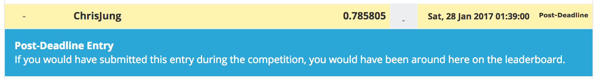

# Kaggle/Santander Customer Satisfaction

<div align="center">
  <br><br>
</div>

## Abstract
[Santander Customer Satisfaction Competition](https://www.kaggle.com/c/santander-customer-satisfaction)

- Host : [**Santander Bank**](https://www.santanderbank.com/us/personal), a British bank, wholly owned by the Spanish Santander Group.
- Prize : $ 60,000
- Problem : Binary Classification
- Evaluation : [AUC](https://en.wikipedia.org/wiki/Receiver_operating_characteristic)
- Period : Mar 2 2016 ~ May 2 2016 (61 days)

Santander Bank is asking Kagglers to help them identify dissatisfied customers early in their relationship. Doing so would allow Santander to take proactive steps to improve a customer's happiness before it's too late.

In this competition, you'll work with hundreds of anonymized features to predict if a customer is satisfied or dissatisfied with their banking experience.

## Result
| Submission | CV LogLoss | Public LB | Rank | Private LB | Rank |
|:----------:|:----------:|:---------:|:----:|:----------:|:----:|
| bare_minimum | 0.800430 | 0.797948 | **3986** | 0.785805 | **3958** |
| kweonwooj redux| 0.821226 | 0.836279 | **3029** | 0.822967 | **2917** |
| kweonwooj | | 0.840797 | **1667** | 0.826500 | **947** |
| toshi_k redux | 0.8418 | 0.840002 | **2122** | 0.826658 | **810** |
| wpppj redux | 0.841137 | 0.839622 | **2232** | 0.826814 | **556** |

Total teams : 5,123

## How to Run

**[Data]** 

Place data in ```input``` directory. You can download data from [here](https://www.kaggle.com/c/santander-customer-satisfaction/data).

**[Code]**

Above results can be replicated by runinng

```
python code/main.py
```
for each of the directories.

Make sure you are on Python 3.5.2 with library versions same as specified in requirements.txt

## Add requirements.txt

**[Submit]**

Submit the resulting csv file [here](https://www.kaggle.com/c/santander-customer-satisfaction/submissions/attach) and verify the score.

## Expected Result

for bare minimum
<div align="center">
  <br><br>
</div>

for reduced version of kweonwooj
<div align="center">
  <br><br>
</div>

## Objective
- modularize the codes following the best practices
- be able to reproduce, re-use the modules developed here
- use annotation + object detection method, it is key methodology in image classification

## Winning Methods
- 3rd place solution on [Forum](https://www.kaggle.com/c/santander-customer-satisfaction/forums/t/20978/3rd-place-solution), [Github](https://github.com/diefimov/santander_2016) by Dmitry Efimov
- 7th place solution on [Forum](https://www.kaggle.com/c/santander-customer-satisfaction/forums/t/21932/7th-place-post-competition) by Francisco Javier Díaz Herrera
- 12th place solution on [Forum](https://www.kaggle.com/c/santander-customer-satisfaction/forums/t/20811/my-12th-place-simple-solution) by Antonio José Navarro Céspedes
- 13th place solution on [Forum](https://www.kaggle.com/c/santander-customer-satisfaction/forums/t/20786/13th-place-good-or-bad) by Ouranos
- 34th place solution on [Forum](https://www.kaggle.com/c/santander-customer-satisfaction/forums/t/22089/34th-place-code), [Github](https://github.com/pjpan/Practice/tree/master/Kaggle-SantanderCustomerSatisfaction) by wpppj
- 44th place solution on [Forum](https://www.kaggle.com/c/santander-customer-satisfaction/forums/t/20858/44th-place-solution), [Github](https://github.com/toshi-k/kaggle-santander-customer-satisfaction) by toshi_k
- [How to get Rank 24](https://www.kaggle.com/c/santander-customer-satisfaction/forums/t/20773/how-to-get-rank-24)
- [Possible 14th place](https://www.kaggle.com/shahnawazakhtar/santander-customer-satisfaction/14th-place-private-lb-script/discussion)