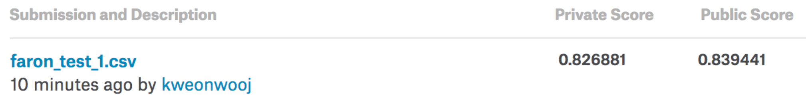

# Kaggle/Santander Customer Satisfaction

<div align="center">
  <br><br>
</div>

## Abstract
[Santander Customer Satisfaction Competition](https://www.kaggle.com/c/santander-customer-satisfaction)

- Host : [**Santander Bank**](https://www.santanderbank.com/us/personal), a British bank, wholly owned by the Spanish Santander Group.
- Prize : $ 60,000
- Problem : Binary Classification
- Evaluation : [AUC](https://en.wikipedia.org/wiki/Receiver_operating_characteristic)
- Period : Mar 2 2016 ~ May 2 2016 (61 days)

Santander Bank is asking Kagglers to help them identify dissatisfied customers early in their relationship. Doing so would allow Santander to take proactive steps to improve a customer's happiness before it's too late.

This competition requires you to deal with combination of sparse, noisy and weak predictors effectively. Since the feature names are provided with anonymity, there is limitation in feature interactions, and general scheme of feature engineering spans from clipping outliers, dropping duplicate and sparse columns, extracting PCA/K-means/t-SNE features and adding count of zeros. Even with enough feature engineering, a single model prediction will have difficulty climbing the ladder of Private LB. 

This competition requires an ensemble of multiple models and variety of feature+model combinations as well as more iterated blending techniques to rise to the top of the ladder. 3rd place team had 6 members each with multiple feature+model predictions, they all utilized 5-fold x 20 times cv seed, and ensembled all of their predictions to reach the top place. A solution from one of the 3rd place team ranks 509th place (Top 10%) all by itself. This tells us the importance of ensemble in this competition.

Although time consuming, well structured cv seed and adding diversity in single models by combining multiple feature+model leads to more generalizable result.

My re-implentation includes partial re-implementation of winner's solutions, hence their Private LB rank is not high as their actual rank.

## Result
| Submission | CV LogLoss | Public LB | Rank | Private LB | Rank |
|:----------:|:----------:|:---------:|:----:|:----------:|:----:|
| bare_minimum | 0.800430 | 0.797948 | **3986** | 0.785805 | **3958** |
| kweonwooj redux| 0.821226 | 0.836279 | **3029** | 0.822967 | **2917** |
| kweonwooj | | 0.840797 | **1667** | 0.826500 | **947** |
| toshi_k redux | 0.8418 | 0.840002 | **2122** | 0.826658 | **810** |
| wpppj redux | 0.841137 | 0.839622 | **2232** | 0.826814 | **556** |
| mathias from Team Leustago | | 0.839441 | **2302** | 0.826881 | **509** |

Total teams : 5,123

## How to Run

**[Data]** 

Place data in ```input``` directory. You can download data from [here](https://www.kaggle.com/c/santander-customer-satisfaction/data).

**[Code]**

Above results can be replicated by runinng

```
python code/main.py
```
for each of the directories.

Make sure you are on Python 2.7 with library versions same as specified in requirements.txt

## Add requirements.txt

**[Submit]**

Submit the resulting csv file [here](https://www.kaggle.com/c/santander-customer-satisfaction/submissions/attach) and verify the score.

## Expected Result

for bare minimum
<div align="center">
  <br><br>
</div>

for mathias's solution form Team Leustago (3rd place)
<div align="center">
  <br><br>
</div>

## What I've learned
- Importance of ensemble in squeezing the private LB score
- Techniques of adding diversity to the prediction
	- combination of feature sets
	- combination of algorithms
	- multiple sets of 5-fold cross validation
	- power of rank averaging in combining multiple submissions

## Winning Methods
- 3rd place solution on [Forum](https://www.kaggle.com/c/santander-customer-satisfaction/forums/t/20978/3rd-place-solution), [Github](https://github.com/diefimov/santander_2016) by Dmitry Efimov
- 7th place solution on [Forum](https://www.kaggle.com/c/santander-customer-satisfaction/forums/t/21932/7th-place-post-competition) by Francisco Javier Díaz Herrera
- 12th place solution on [Forum](https://www.kaggle.com/c/santander-customer-satisfaction/forums/t/20811/my-12th-place-simple-solution) by Antonio José Navarro Céspedes
- 13th place solution on [Forum](https://www.kaggle.com/c/santander-customer-satisfaction/forums/t/20786/13th-place-good-or-bad) by Ouranos
- 34th place solution on [Forum](https://www.kaggle.com/c/santander-customer-satisfaction/forums/t/22089/34th-place-code), [Github](https://github.com/pjpan/Practice/tree/master/Kaggle-SantanderCustomerSatisfaction) by wpppj
- 44th place solution on [Forum](https://www.kaggle.com/c/santander-customer-satisfaction/forums/t/20858/44th-place-solution), [Github](https://github.com/toshi-k/kaggle-santander-customer-satisfaction) by toshi_k